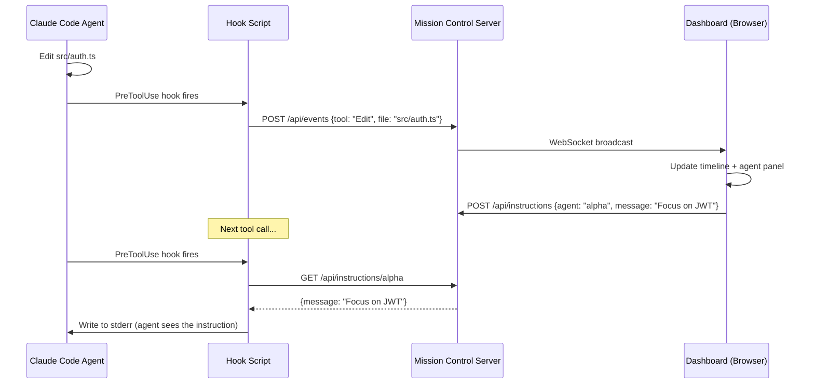

<div align="center">

# Claude Mission Control

**Real-time command center for Claude Code agents.**

[](LICENSE)
[](https://nodejs.org)
[](https://modelcontextprotocol.io)

See what your Claude Code agents are doing. Assign missions. Watch them work. Step in when needed.

</div>

---

## The Problem

You're running multiple Claude Code agents — maybe one building auth, another writing tests, a third reviewing a PR. But it's all happening in separate terminals. You lose track of what each agent is doing, which files they're touching, and whether they're stuck.

## The Solution

Mission Control is a web dashboard that connects to Claude Code via hooks. Every tool call, file edit, and bash command is streamed to the dashboard in real-time. You see all your agents at a glance, assign them missions, track dependencies, and send instructions — like a command center.

```
┌─ MISSION CONTROL ──────────────────────────── 3 agents ● 5 missions ─┐
├──────────────┬───────────────────────────────────────────────────────-─┤
│ > AGENTS     │ > MISSIONS                                             │
│              │                                                        │
│ ● alpha      │ [QUEUED]  Auth middleware         priority: HIGH        │
│   editing    │ [ACTIVE]  API routes        ← alpha  02:34 elapsed     │
│   auth.ts    │ [ACTIVE]  Unit tests        ← bravo  01:12 elapsed     │
│              │ [DONE]    Project setup      completed 5m ago           │
│ ● bravo      │ [BLOCKED] E2E tests         waiting on: API routes     │
│   running    │                                                        │
│   npm test   │────────────────────────────────────────────────────────│
│              │ > TIMELINE                                              │
│ ○ charlie    │                                                        │
│   idle 45s   │ 12:34:02 alpha  EDIT  src/middleware/auth.ts            │
│              │ 12:34:01 bravo  BASH  npm test --coverage               │
│──────────────│ 12:33:58 alpha  READ  package.json                     │
│ > SEND MSG   │ 12:33:55 alpha  BASH  git status                       │
│ to: alpha    │ 12:33:50 charlie READ src/routes/payments.ts           │
│ > _          │ 12:33:48 alpha  WRITE src/types/auth.d.ts              │
└──────────────┴────────────────────────────────────────────────────────┘
```

**Design:** Palantir Gotham-inspired web UI. Dark grid layout, data-dense, monospace font, blue accent on deep dark background. Keyboard-driven (vim keys, tab, arrow keys). Sub-100ms renders — no React, no virtual DOM, direct DOM manipulation. Feels like intelligence software.

---

## Features

| Feature | Description |
|---------|-------------|
| **Live Agent Monitor** | See all active agents, what they're working on, files they're touching — in real-time |
| **Kanban Mission Board** | Create missions, drag between Queued → Active → Done columns |
| **Dependency Tracking** | Visual arrows: "Tests wait on API" — auto-unblock when deps complete |
| **Send Instructions** | Push messages to running agents from the dashboard |
| **Activity Timeline** | Color-coded log of every tool call, file edit, bash command per agent |
| **Stuck Agent Alerts** | Detect when an agent hasn't made progress in 2+ minutes |
| **Anti-Pattern Detection** | Spot correction spirals, repeated prompts, agents going in circles |
| **Cost Tracking** | Per-mission cost breakdown with model info |

---

## Quick Start

```bash
npx claude-mission-control install   # Add hooks to Claude Code
npx claude-mission-control           # Start dashboard on port 4280
```

Open http://localhost:4280 — your agents appear automatically when they start working.

---

## How It Works

1. **Hooks** — Claude Code hooks (PreToolUse, PostToolUse, Stop) fire on every action
2. **Events** — Hook POSTs event data to Mission Control server
3. **Dashboard** — Server broadcasts to browser via WebSocket
4. **Instructions** — Dashboard queues a message → hook picks it up on next PreToolUse → writes to stderr → agent sees it



---

## Tech Stack

| Component | Choice | Why |
|-----------|--------|-----|
| Runtime | Node.js + TypeScript | Single language, `npx` installable |
| HTTP | Node.js `http` (no Express) | Zero framework deps |
| WebSocket | `ws` | Lightweight, battle-tested |
| Database | `better-sqlite3` | Embedded, no server needed |
| Dashboard | Vanilla HTML/CSS/JS | No build step, served directly |
| Only 2 deps | `better-sqlite3` + `ws` | Minimal footprint |

---

## Status

**Under active development.** See [docs/PLAN.md](docs/PLAN.md) for the full implementation plan and [docs/RESEARCH.md](docs/RESEARCH.md) for competitive analysis.

---

## Credits

- Inspired by [claude-devfleet](https://github.com/LEC-AI/claude-devfleet), [disler/observability](https://github.com/disler/claude-code-hooks-multi-agent-observability), [agent-flow](https://github.com/patoles/agent-flow), [MeisnerDan/mission-control](https://github.com/MeisnerDan/mission-control)

## License

Apache 2.0 — See [LICENSE](LICENSE)

---

<div align="center">

Made by [Cyrus David Pastelero](https://github.com/Cyvid7-Darus10)

</div>
