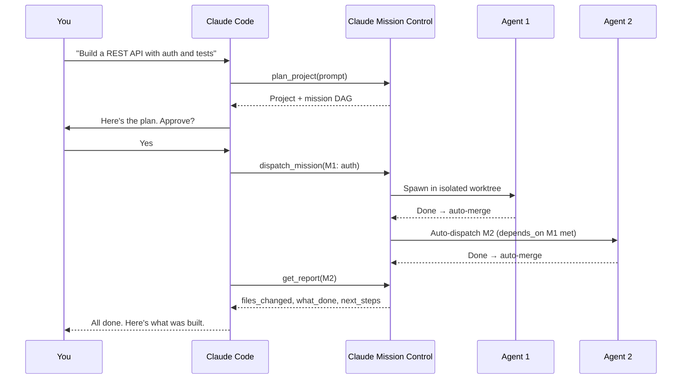
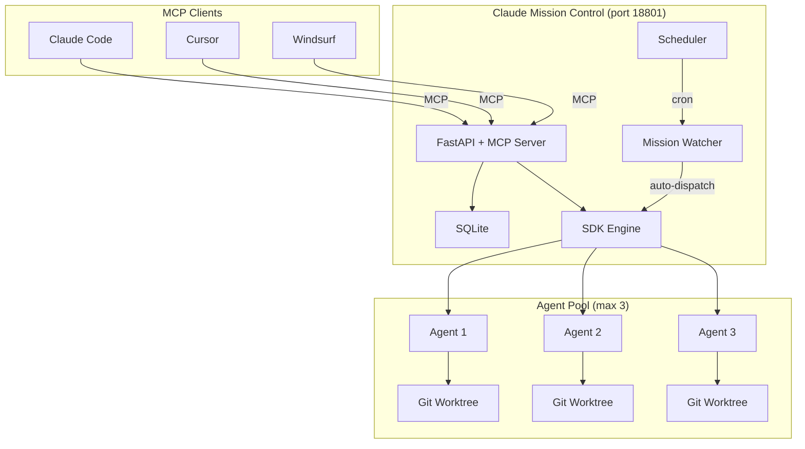

<div align="center">

# Claude Mission Control

**Multi-agent orchestration for Claude Code — dispatch parallel agents in isolated git worktrees.**

[](LICENSE)
[](https://python.org)
[](https://nodejs.org)
[](https://modelcontextprotocol.io)

Dispatch Claude Code agents to work on coding tasks in parallel. Each agent runs in an isolated git worktree, submits structured reports, and auto-chains to the next mission when dependencies are met.

Improved fork of [claude-devfleet](https://github.com/LEC-AI/claude-devfleet).

</div>

---

## Why Claude Mission Control?

Working on a large feature? Instead of one agent doing everything sequentially, split the work:

```
You: "Build a REST API with auth, CRUD endpoints, and tests"

Claude Mission Control:
  Agent 1 → auth module (worktree: devfleet/auth)
  Agent 2 → CRUD endpoints (worktree: devfleet/crud, depends on: Agent 1)
  Agent 3 → test suite (worktree: devfleet/tests, depends on: Agent 1 + 2)

All agents auto-merge on success. You get a structured report.
```

---

## Quick Start

### One-Command Start

```bash
git clone https://github.com/Cyvid7-Darus10/claude-mission-control.git
cd claude-mission-control
./start.sh
```

- **UI:** http://localhost:3100
- **API:** http://localhost:18801
- **API Docs:** http://localhost:18801/docs

### Connect to Claude Code

```bash
claude mcp add claude-mission-control --transport http http://localhost:18801/mcp
```

Then in Claude Code:

```
"Use claude-mission-control to plan a project: build a REST API with auth and tests"
```

---

## How It Works



---

## Architecture



---

## Features

### Core

| Feature | Description |
|---------|-------------|
| **Mission Dispatch** | Create tasks, dispatch Claude agents autonomously |
| **Git Worktree Isolation** | Each agent gets its own branch, auto-merged on success |
| **Live Streaming** | Real-time terminal output via SSE |
| **Structured Reports** | Agents report: files changed, what's done, what's open, next steps |
| **AI Planner** | Describe what you want → Claude creates a project with chained missions |
| **Session Resume** | Resume failed sessions with full conversation context |

### Multi-Agent Orchestration

| Feature | Description |
|---------|-------------|
| **Dependency DAG** | Missions depend on other missions; auto-dispatch when deps are met |
| **Sub-Mission Delegation** | Agents create sub-missions via MCP, dispatched to other agents |
| **Parallel Auto-Loop** | Planner generates parallel tasks, dispatches multiple agents simultaneously |
| **Scheduled Agents** | Cron schedules for recurring tasks (nightly tests, daily reviews) |
| **Mission Events** | Full audit log: auto_dispatched, dependency_met, dispatch_failed |

### MCP Tools

Any MCP-compatible client can use these tools:

| Tool | Description |
|------|-------------|
| `plan_project` | Natural language → project with chained missions |
| `create_project` | Create a project manually |
| `create_mission` | Add a mission with dependencies and auto-dispatch |
| `dispatch_mission` | Send an agent to work on a mission |
| `get_mission_status` | Check progress (preferred over `wait_for_mission`) |
| `get_report` | Read structured report |
| `cancel_mission` | Cancel a running mission |
| `get_dashboard` | Overview: running agents, stats, recent activity |
| `list_projects` | Browse all projects |
| `list_missions` | List missions, filter by status |

### Agent Intelligence

Each dispatched agent automatically gets two MCP servers:

**Context Server** — what the agent needs to know:
- Mission requirements and acceptance criteria
- Project info and recent history
- Reports from previous sessions
- What other agents are working on

**Tools Server** — what the agent can do:
- Submit structured end-of-mission reports
- Create sub-missions for other agents
- Request code review (auto-dispatched after completion)
- Check sub-mission progress

---

## Setup

### Prerequisites

- Python 3.11+
- Node.js 18+
- [Claude Code CLI](https://docs.anthropic.com/en/docs/claude-code) installed

### Option A: One-Command (Recommended)

```bash
git clone https://github.com/Cyvid7-Darus10/claude-mission-control.git
cd claude-mission-control
./start.sh
```

### Option B: Manual

```bash
git clone https://github.com/Cyvid7-Darus10/claude-mission-control.git
cd claude-mission-control

# Backend
python3 -m venv venv
source venv/bin/activate
pip install -r backend/requirements.txt
cd backend && uvicorn app:app --host 0.0.0.0 --port 18801 --reload

# Frontend (separate terminal)
cd frontend && npm install && npm run dev
```

### Option C: Docker

```bash
docker compose up -d
# UI: http://localhost:3101
# API: http://localhost:18801
```

### Connect Your Editor

<details>
<summary><b>Claude Code</b></summary>

```bash
claude mcp add claude-mission-control --transport http http://localhost:18801/mcp
```

</details>

<details>
<summary><b>Cursor</b></summary>

Add to `.cursor/mcp.json`:
```json
{
  "mcpServers": {
    "claude-mission-control": {
      "type": "http",
      "url": "http://localhost:18801/mcp"
    }
  }
}
```

</details>

<details>
<summary><b>Windsurf / Cline</b></summary>

Add to your MCP settings:
```json
{
  "claude-mission-control": {
    "type": "http",
    "url": "http://localhost:18801/mcp"
  }
}
```

</details>

---

## Configuration

| Variable | Default | Description |
|----------|---------|-------------|
| `DEVFLEET_DB` | `data/devfleet.db` | SQLite database path |
| `DEVFLEET_MAX_AGENTS` | `3` | Max concurrent agents |
| `DEVFLEET_ENGINE` | `sdk` | Dispatch engine (`sdk` or `cli`) |
| `DEVFLEET_WATCHER_INTERVAL` | `5` | Mission watcher poll interval (seconds) |
| `DEVFLEET_SCHEDULER_INTERVAL` | `60` | Scheduler check interval (seconds) |
| `DEVFLEET_PROJECTS_DIR` | `projects/` | Base directory for planner-created projects |

---

## Plugins

Extend Claude Mission Control with custom tools and hooks. Drop a Python file into `plugins/`:

```python
# plugins/slack_notify.py
def register(registry):
    @registry.hook("post_complete")
    async def notify_slack(mission, report):
        import httpx
        await httpx.AsyncClient().post(WEBHOOK, json={
            "text": f"Mission '{mission['title']}' done! Files: {report['files_changed']}"
        })
```

Hook events: `pre_dispatch`, `post_complete`, `post_fail`, `pre_plan`, `post_plan`

Plugin tools automatically appear as MCP tools.

---

## Port Map

| Service | Port |
|---------|------|
| Claude Mission Control UI (local) | 3100 |
| Claude Mission Control UI (Docker) | 3101 |
| Claude Mission Control API + MCP | 18801 |

---

## Credits

- **[claude-devfleet](https://github.com/LEC-AI/claude-devfleet)** by LEC-AI — Original multi-agent orchestration platform. The foundation.

## License

Apache 2.0 — See [LICENSE](LICENSE)

---

<div align="center">

Made by [Cyrus David Pastelero](https://github.com/Cyvid7-Darus10)

</div>
