<div align="center">

# Claude Mission Control

**Real-time command center for Claude Code agents.**

[](LICENSE)
[](https://nodejs.org)
[](https://nodejs.org)

See what your Claude Code agents are doing. Assign missions. Watch them work. Step in when needed.

Palantir Gotham-inspired dark UI. Access-code protected. Mobile responsive. Only 2 dependencies.

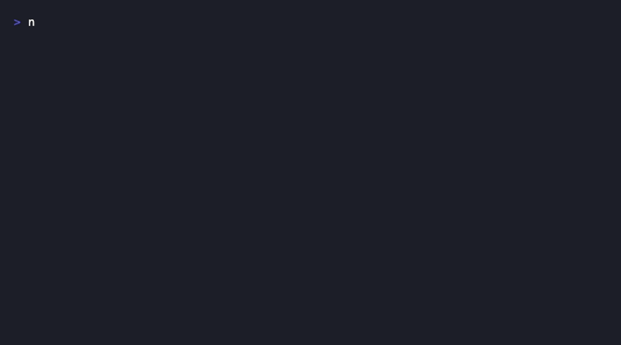

</div>

---

## The Problem

You're running multiple Claude Code agents — maybe one building auth, another writing tests, a third reviewing a PR. But it's all happening in separate terminals. You lose track of what each agent is doing, which files they're touching, and whether they're stuck.

## The Solution

Mission Control connects to Claude Code via hooks. Every tool call, file edit, and bash command is streamed to a web dashboard in real-time. You see all agents at a glance, assign missions, track dependencies, and send instructions.

<div align="center">
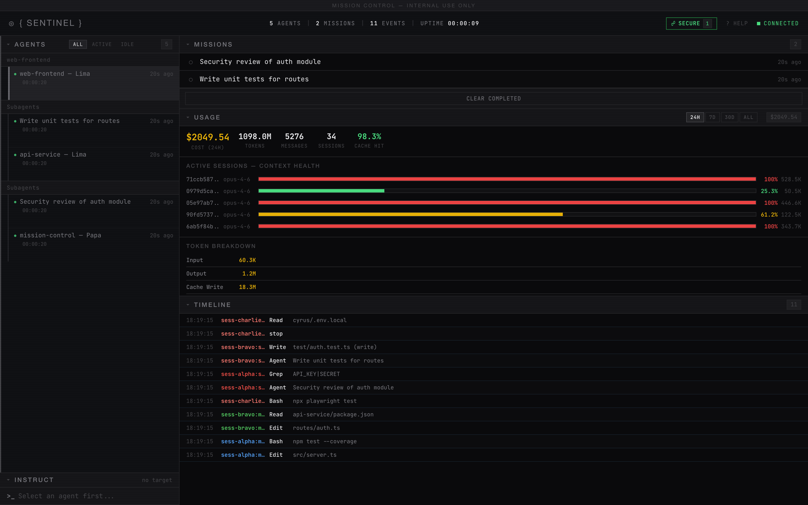
<br>
<sub>Live dashboard showing agents, missions, real token costs, context health, and timeline</sub>
</div>

---

## Setup

### Prerequisites

- **Node.js 18+** (`node -v` to check)
- **Claude Code** installed and working

### Step 1: Clone and Install

```bash
git clone https://github.com/Cyvid7-Darus10/claude-mission-control.git
cd claude-mission-control
npm install
npm rebuild better-sqlite3
```

### Step 2: Install Hooks into Claude Code

```bash
npx tsx src/index.ts install
```


This adds hooks to `~/.claude/settings.json` so Claude Code reports activity to Mission Control. You only need to do this once.

### Step 3: Start the Dashboard

```bash
npx tsx src/index.ts
```

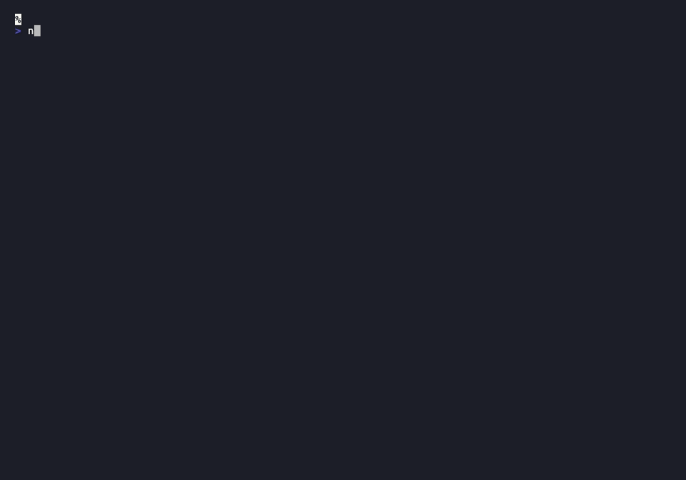

Open **http://localhost:4280** in your browser. Enter the **6-digit access code** shown in the terminal.

### Step 4: Use Your Phone as a Companion

Keep the dashboard on your phone next to your laptop while you work. All updates stream in real-time via WebSocket.

1. Find the **Network URL** in the terminal (e.g., `http://192.168.1.42:4280`)
2. Open it on your phone's browser
3. Enter the **6-digit access code**

<div align="center">
<table>
<tr>
<td align="center">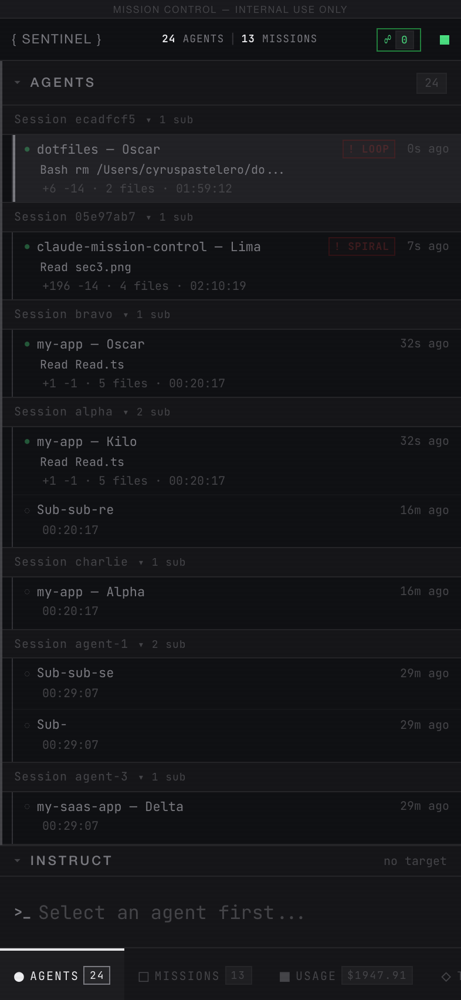<br><sub>Agents</sub></td>
<td align="center">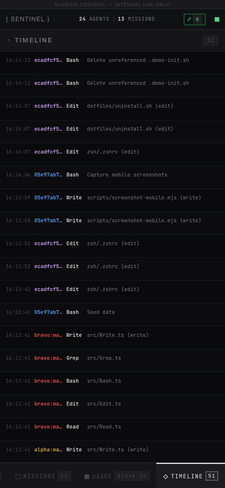<br><sub>Timeline</sub></td>
<td align="center">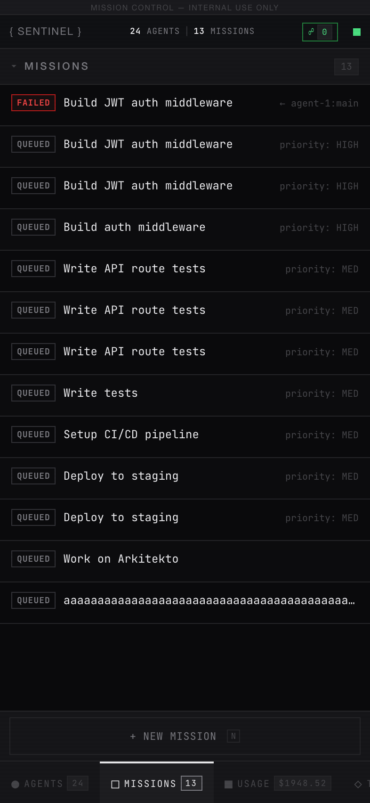<br><sub>Missions</sub></td>
<td align="center">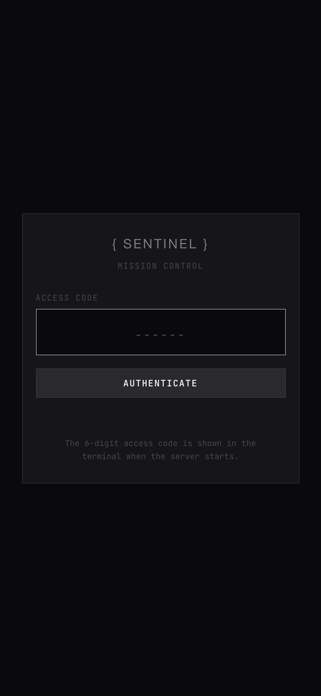<br><sub>Login</sub></td>
</tr>
</table>
<sub>Swipe between Agents, Missions, Usage, and Timeline tabs</sub>
</div>

The access code changes every time the server restarts. Sessions last 24 hours.

### Step 5: Use Claude Code Normally

Open another terminal and run `claude` as usual. Your agent will appear on the dashboard automatically — every tool call streams in real-time.

---

## How It Works

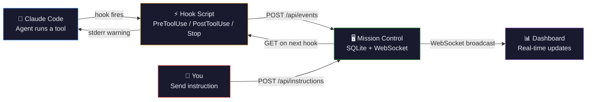

---

## Features

### Mobile Companion

Open the **Network URL** on your phone to use Mission Control as a side monitor while you code. The mobile view features:

- **Tab bar** at the bottom — switch between Agents, Missions, Usage, and Timeline
- **Touch-optimized** — larger tap targets, swipe-friendly lists
- **Live updates** — same WebSocket connection, real-time events
- **Send instructions** — tap an agent, type a message, send from your phone
- **Anti-pattern alerts** — STUCK, LOOP, SPIRAL badges visible on mobile

### Dashboard Panels

| Panel | What It Shows |
|-------|--------------|
| **Agents** | Live agent status, current tool + target file, diff stats (+/-), files touched, session duration, anti-pattern alerts |
| **Missions** | Task board with subtask progress bars, dependency tracking, priority, agent assignment |
| **Usage & Costs** | Real token costs from JSONL logs, context window health, daily/model/session cost breakdowns, period selector (24h/7d/30d/All) |
| **Timeline** | Every tool call scrolling in real-time — click any row to expand full input/output details |
| **Command Bar** | Send instructions to any agent — delivered via stderr on next tool call |

### Agent Monitoring

Each agent row shows rich, at-a-glance status:

| Info | Description |
|------|-------------|
| **Status dot** | `●` active (pulsing), `○` idle (60s), `◌` disconnected (5min) |
| **Live activity** | Current tool + target file (e.g., `Edit auth.ts`, `Bash npm test`) |
| **Diff stats** | Lines added/removed across all edits (e.g., `+142 -38`) |
| **Files touched** | Count of unique files the agent has modified |
| **Session duration** | Elapsed time since agent first appeared |
| **Alert badges** | STUCK, LOOP, SPIRAL, ERRORS, MARATHON — with browser desktop notifications |

### Mission Board

| Feature | Description |
|---------|-------------|
| **Create missions** | Title, description, priority. Assign to agents. Keyboard shortcut: `n` |
| **Status tracking** | Queued → Active → Completed/Failed with colored status tags |
| **Dependency DAG** | Missions can depend on other missions. Blocked missions auto-unblock when deps complete. Cycle detection prevents loops |
| **Subtask progress** | Missions support a `subtasks` JSON array of `{id, title, done}` items. Dashboard renders a green progress bar with X/Y count |
| **Send instructions** | Select an agent, type a message → delivered via stderr on next tool call |

### Usage & Cost Tracking

Mission Control reads Claude Code's JSONL session logs (`~/.claude/projects/`) to compute **real API costs** from actual token counts — not estimates. Inspired by [sniffly](https://github.com/chiphuyen/sniffly).

| Metric | Source |
|--------|--------|
| **Total Cost** | Actual input/output/cache tokens x model pricing (Opus $15/$75, Sonnet $3/$15, Haiku $0.80/$4 per MTok) |
| **Token Breakdown** | Input, output, cache creation, cache read — with cache hit rate % |
| **Context Window Health** | Color-coded bars per active session (green < 60%, yellow 60-85%, red > 85%). Detects active sessions by PID liveness |
| **Cost by Model** | Per-model cost bars (e.g., opus-4-6, sonnet-4-6, haiku-4-5) |
| **Daily Costs** | Cost per day with horizontal bar chart |
| **Session Costs** | Per-session cost with message count, model, and recency |
| **Period Selector** | Switch between 24H, 7D, 30D, and All Time — all queries scoped to selected range |

Data persists in a `usage_daily` summary table, so historical cost data survives even after raw event retention (default 90 days).

### Anti-Pattern Detection

Inspired by [agenttop](https://github.com/vicarious11/agenttop) and [builderz-labs/mission-control](https://github.com/builderz-labs/mission-control).

| Alert | Trigger | Severity |
|-------|---------|----------|
| **STUCK** | No events for 2+ minutes | Warning (blinking) |
| **LOOP** | 3+ identical consecutive tool calls, or convergence score > 3.0 (catches subtle A→B→A→B patterns) | Danger (blinking) |
| **SPIRAL** | Same file edited 3+ times in last 6 tool calls (correction spiral) | Danger (blinking) |
| **ERRORS** | 5+ tool failures in a session (error burst) | Danger (blinking) |
| **MARATHON** | Session running 30+ minutes continuously | Info (steady) |

All alerts also trigger **browser desktop notifications** (with permission) so you can monitor agents while working in other tabs.

### Expandable Timeline

Click any timeline event to expand and see the full details:

- **File tools**: full path, edit diff (old → new), content preview
- **Bash**: command, stderr/stdout output
- **Search**: pattern, results
- **Errors**: error messages, stack traces

Smart per-tool summaries cover 10+ tool types including Agent, SendMessage, WebFetch, Skill, and Task operations.

### Security

<div align="center">
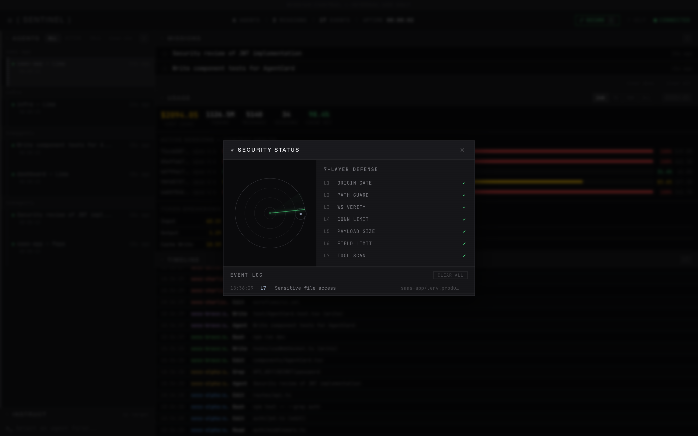
<br>
<sub>Security panel: radar visualization, 7-layer defense status, and event log</sub>
</div>

**Access control:**

| Feature | Description |
|---------|-------------|
| **Access Code** | Random 6-digit code generated on each server start. Required to view the dashboard. Shown only in the terminal |
| **Session Cookies** | `HttpOnly`, `SameSite=Strict`, 24-hour expiry. No passwords stored |
| **WebSocket Auth** | WebSocket connections also require a valid session cookie |
| **Login Page** | Clean login screen at `/login` — auto-submits when 6 digits entered |

<div align="center">
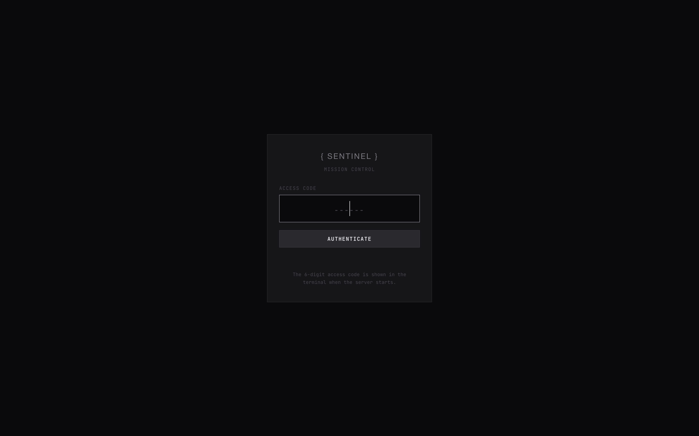
</div>

**7-layer defense system** (visible in the Security panel — click the shield icon):

| Layer | Name | What It Blocks |
|-------|------|---------------|
| L1 | **Origin Gate** | HTTP requests from unauthorized origins |
| L2 | **Path Guard** | Path traversal attempts (`../`) |
| L3 | **WS Verify** | WebSocket connections from unauthorized origins |
| L4 | **Conn Limit** | More than 50 simultaneous WebSocket clients |
| L5 | **Payload Size** | Request bodies exceeding 1MB |
| L6 | **Field Limit** | Oversized fields (title, description, tool I/O) |
| L7 | **Tool Scan** | Dangerous commands (`rm -rf /`, `chmod 777`, `curl \| sh`), sensitive file access (`.env`, `.ssh/`, credentials), secret exposure (API keys, private keys) |

**Additional protections:**

| Feature | Description |
|---------|-------------|
| **Secret Scanner** | Scans tool output for leaked secrets — AWS keys, GitHub tokens, API keys, JWTs, private keys |
| **Network Access** | Accepts connections from localhost and private network IPs (192.168.x.x, 10.x.x.x, 172.16-31.x.x) |
| **Hook Token** | Hook endpoints (`POST /api/events`, `GET /api/instructions`) require a Bearer token stored in `~/.claude-mission-control/hook-token`. Generated on server start, read by hook script automatically |
| **Failed Auth Logging** | Invalid access code attempts are logged as security events |

### Keyboard Shortcuts

<div align="center">
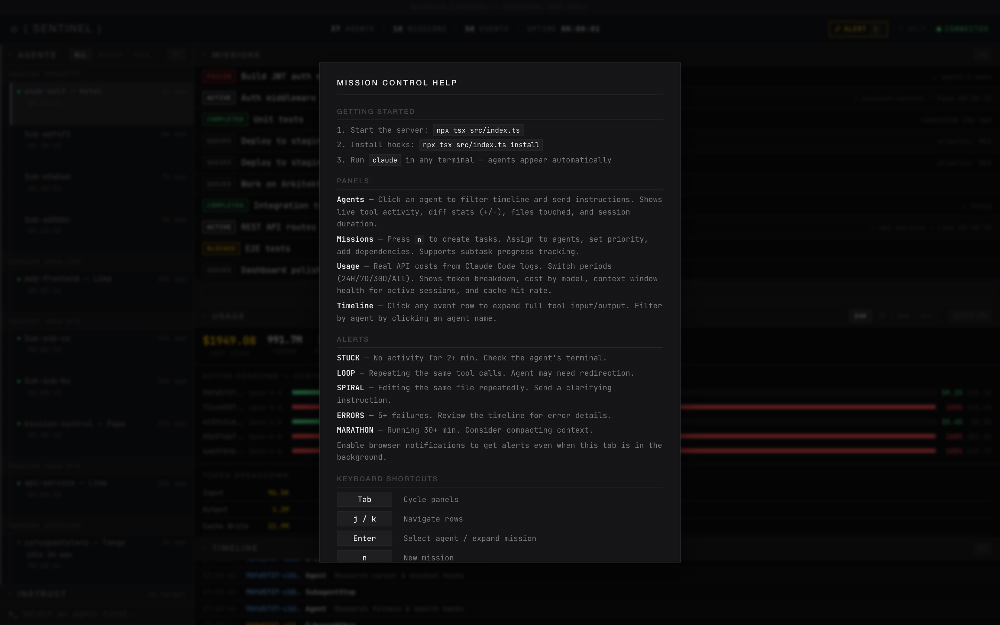
<br>
<sub>Press <kbd>?</kbd> to open the help overlay</sub>
</div>

| Key | Action |
|-----|--------|
| `Tab` | Cycle focus: Agents → Missions → Usage → Timeline |
| `j` / `k` | Navigate up/down in focused panel |
| `Enter` | Select agent (filters timeline + shows agent usage) |
| `n` | New mission |
| `i` | Focus instruction input |
| `/` | Clear timeline filter |
| `?` | Toggle keyboard shortcuts help |
| `Esc` | Cancel / unfocus |

---

## What Gets Installed Where

| Component | Location |
|-----------|----------|
| Server + dashboard code | Where you cloned the repo |
| SQLite database | `~/.claude-mission-control/data.db` |
| Hook token | `~/.claude-mission-control/hook-token` (auto-generated, read by hook script) |
| Hook entries | `~/.claude/settings.json` (PreToolUse, PostToolUse, SubagentStart, SubagentStop, Stop) |
| Hook script | `<repo>/src/hook/mission-control-hook.js` |
| Token data source (read-only) | `~/.claude/projects/*/\*.jsonl` (Claude Code session logs) |

---

## Commands

```bash
npx tsx src/index.ts              # Start the server (default port 4280)
npx tsx src/index.ts --port 5000  # Custom port
npx tsx src/index.ts --open       # Start and open browser
npx tsx src/index.ts install      # Install hooks into Claude Code
npx tsx src/index.ts uninstall    # Remove hooks from Claude Code
```

---

## API

All endpoints return JSON. Dashboard endpoints require a session cookie (via access code login). Hook endpoints (`POST /api/events`, `GET /api/instructions/:agentId`) require a Bearer token (`~/.claude-mission-control/hook-token`). `POST /api/auth` is open.

| Method | Endpoint | Auth | Description |
|--------|----------|------|-------------|
| `POST` | `/api/auth` | No | Authenticate: `{ code: "123456" }` → sets session cookie |
| `GET` | `/api/dashboard` | Yes | Stats: agent count, mission count, events |
| `GET` | `/api/agents` | List all agents |
| `PATCH` | `/api/agents/:id` | Rename an agent |
| `GET` | `/api/agents/:id/events` | Event history for an agent |
| `GET` | `/api/missions` | List missions (optional `?status=` filter) |
| `POST` | `/api/missions` | Create mission: `{ title, description, depends_on?, priority? }` |
| `PATCH` | `/api/missions/:id` | Update status, assign agent, complete/fail |
| `DELETE` | `/api/missions/:id` | Delete (queued only) |
| `POST` | `/api/events` | Receive hook events (used by hook script) |
| `GET` | `/api/events` | Query events (optional `?agent_id=&limit=&offset=`) |
| `POST` | `/api/instructions` | Send instruction: `{ target_agent_id, message }` |
| `GET` | `/api/instructions/:agentId` | Get pending instructions (used by hook script) |
| `GET` | `/api/usage?hours=24` | Aggregated usage stats from hook events (tool calls, sessions, daily costs). `hours=0` for all time |
| `GET` | `/api/tokens?hours=24` | Real token usage from Claude Code JSONL logs (costs, models, cache rates). `hours=0` for all time |

WebSocket on same port — connects automatically from the dashboard.

---

## Configuration

| Environment Variable | Default | Description |
|---------------------|---------|-------------|
| `MC_EVENT_RETENTION_DAYS` | `90` | Days to keep raw events before purging (historical daily stats persist forever in `usage_daily`) |
| `MC_COST_PER_TOOL_CALL` | `0.003` | Fallback cost estimate per tool call (used when JSONL logs unavailable) |
| `MC_DATA_DIR` | `~/.claude-mission-control` | Database storage directory |
| `CLAUDE_MC_PORT` | `4280` | Port for the hook script to POST events to |

---

## Design

Palantir Gotham-inspired. Dark grid layout, data-dense, neutral grays, no blue tint.

| Element | Value |
|---------|-------|
| Background | `#0a0a0c` |
| Panels | `#161619` |
| Borders | `#252528` |
| Text | `#c8c8cc` |
| Success | `#4ade80` |
| Warning | `#eab308` |
| Danger | `#ef4444` |
| Fonts | JetBrains Mono (code) + system sans-serif (titles) |

No rounded corners. No shadows. No gradients. Sub-100ms renders.

---

## Tech Stack

| Component | Choice | Why |
|-----------|--------|-----|
| Runtime | Node.js + TypeScript | Single language, `npx` runnable |
| HTTP | Node.js `http` (no Express) | Zero framework deps |
| WebSocket | `ws` | Lightweight, battle-tested |
| Database | `better-sqlite3` | Embedded, no external server |
| Dashboard | Vanilla HTML/CSS/JS | No build step, served directly |
| **Total deps** | **2** (`better-sqlite3` + `ws`) | Minimal footprint |

---

## Uninstall

```bash
# Remove hooks from Claude Code
npx tsx src/index.ts uninstall

# Delete the database
rm -r ~/.claude-mission-control

# Delete the repo
rm -r ~/claude-mission-control
```

---

## Credits

Inspired by:
- [sniffly](https://github.com/chiphuyen/sniffly) — JSONL log parsing for real token costs and cache hit rates
- [claude-hud](https://github.com/jarrodwatts/claude-hud) — context window health gauge, active session detection via PID
- [builderz-labs/mission-control](https://github.com/builderz-labs/mission-control) — convergence scoring, secret scanning, visibility-aware polling
- [disler/observability](https://github.com/disler/claude-code-hooks-multi-agent-observability) — expandable timeline, browser notifications, smart tool summaries
- [claude-squad](https://github.com/smtg-ai/claude-squad) — per-agent diff stats, file tracking, session lifecycle
- [agenttop](https://github.com/vicarious11/agenttop) — anti-pattern detection (correction spirals, marathon sessions, error bursts)
- [MeisnerDan/mission-control](https://github.com/MeisnerDan/mission-control) — subtask progress tracking
- [claude_code_agent_farm](https://github.com/Dicklesworthstone/claude_code_agent_farm) — file activity tracking per agent
- [claude-devfleet](https://github.com/LEC-AI/claude-devfleet), [agent-flow](https://github.com/patoles/agent-flow), [Palantir Gotham](https://www.palantir.com/platforms/gotham/)

## License

**Apache License 2.0** — See [LICENSE](LICENSE)

Copyright 2026 Cyrus David Pastelero. All rights reserved.

You are free to use, modify, and distribute this software under the terms of the Apache 2.0 license. **Attribution is required:**

- You must retain the original copyright notice and license in all copies or substantial portions of the software
- You must clearly state any changes you made
- You must include a notice in any derivative work that it is based on Claude Mission Control by Cyrus David Pastelero
- You may not use the project name, logo, or branding to imply endorsement of derivative works

If you build something with this, a link back to [this repo](https://github.com/Cyvid7-Darus10/claude-mission-control) is appreciated.

---

<div align="center">

Made by [Cyrus David Pastelero](https://github.com/Cyvid7-Darus10)

</div>
