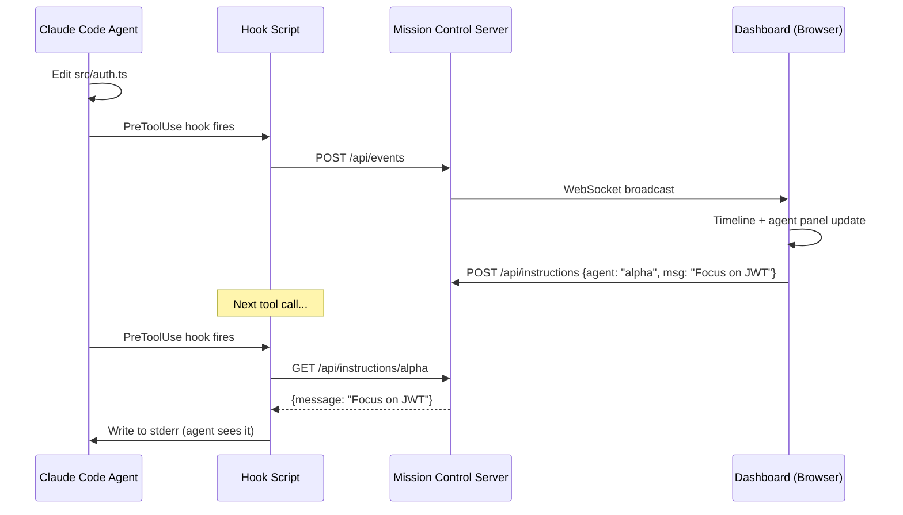

<div align="center">

# Claude Mission Control

**Real-time command center for Claude Code agents.**

[](LICENSE)
[](https://nodejs.org)
[](https://nodejs.org)

See what your Claude Code agents are doing. Assign missions. Watch them work. Step in when needed.

Palantir-inspired dark UI. Only 2 dependencies. No React, no Python, no Docker.

</div>

---

## The Problem

You're running multiple Claude Code agents — maybe one building auth, another writing tests, a third reviewing a PR. But it's all happening in separate terminals. You lose track of what each agent is doing, which files they're touching, and whether they're stuck.

## The Solution

Mission Control connects to Claude Code via hooks. Every tool call, file edit, and bash command is streamed to a web dashboard in real-time. You see all agents at a glance, assign missions, track dependencies, and send instructions.

```
┌─ MISSION CONTROL ──────────────────────────── 3 agents ● 5 missions ─┐
├──────────────┬───────────────────────────────────────────────────────-─┤
│ > AGENTS     │ > MISSIONS                                             │
│              │                                                        │
│ ● alpha      │ [QUEUED]  Auth middleware         priority: HIGH        │
│   editing    │ [ACTIVE]  API routes        ← alpha  02:34 elapsed     │
│   auth.ts    │ [ACTIVE]  Unit tests        ← bravo  01:12 elapsed     │
│              │ [DONE]    Project setup      completed 5m ago           │
│ ● bravo      │ [BLOCKED] E2E tests         waiting on: API routes     │
│   running    │                                                        │
│   npm test   │────────────────────────────────────────────────────────│
│              │ > TIMELINE                                              │
│ ○ charlie    │                                                        │
│   idle 45s   │ 12:34:02 alpha  EDIT  src/middleware/auth.ts            │
│              │ 12:34:01 bravo  BASH  npm test --coverage               │
│──────────────│ 12:33:58 alpha  READ  package.json                     │
│ > SEND MSG   │ 12:33:55 alpha  BASH  git status                       │
│ to: alpha    │ 12:33:50 charlie READ src/routes/payments.ts           │
│ > _          │ 12:33:48 alpha  WRITE src/types/auth.d.ts              │
└──────────────┴────────────────────────────────────────────────────────┘
```

---

## Setup

### Prerequisites

- **Node.js 18+** (`node -v` to check)
- **Claude Code** installed and working

### Step 1: Clone and Install

```bash
git clone https://github.com/Cyvid7-Darus10/claude-mission-control.git
cd claude-mission-control
npm install
npm rebuild better-sqlite3
```

### Step 2: Install Hooks into Claude Code

```bash
npx tsx src/index.ts install
```

This adds hooks to `~/.claude/settings.json` so Claude Code reports activity to Mission Control. You only need to do this once.

### Step 3: Start the Dashboard

```bash
npx tsx src/index.ts
```

```
  ┌─────────────────────────────────────────┐
  │  { SENTINEL } MISSION CONTROL v0.1.0    │
  ├─────────────────────────────────────────┤
  │                                         │
  │  Local:   http://localhost:4280          │
  │  Network: http://192.168.1.42:4280      │
  │                                         │
  │  Access Code: 847293                    │
  │                                         │
  │  Share the network URL + code with      │
  │  others on the same WiFi network.       │
  └─────────────────────────────────────────┘
```

Open **http://localhost:4280** in your browser. Enter the **6-digit access code** shown in the terminal.

### Step 4: Share with Your Team (Optional)

Anyone on the same WiFi network can view the dashboard:

1. Give them the **Network URL** (e.g. `http://192.168.1.42:4280`)
2. Give them the **Access Code** from the terminal
3. They open the URL on any device (phone, tablet, laptop) and enter the code

The access code changes every time the server restarts. Sessions last 24 hours.

### Step 5: Use Claude Code Normally

Open another terminal and run `claude` as usual. Your agent will appear on the dashboard automatically — every tool call streams in real-time.

---

## How It Works

```
Claude Code runs a tool (Edit, Bash, Read, Write, etc.)
    │
    ▼
Hook fires (PreToolUse / PostToolUse / Stop)
    │
    ▼
Hook script POSTs event to localhost:4280/api/events
    │
    ▼
Server stores in SQLite + broadcasts via WebSocket
    │
    ▼
Dashboard updates in real-time
```



---

## Features

### Dashboard Panels

| Panel | What It Shows |
|-------|--------------|
| **Agents** | Live agent status, current tool + target file, diff stats (+/-), files touched, session duration, anti-pattern alerts |
| **Missions** | Task board with subtask progress bars, dependency tracking, priority, agent assignment |
| **Usage & Costs** | Real token costs from JSONL logs, context window health, daily/model/session cost breakdowns, period selector (24h/7d/30d/All) |
| **Timeline** | Every tool call scrolling in real-time — click any row to expand full input/output details |
| **Command Bar** | Send instructions to any agent — delivered via stderr on next tool call |

### Agent Monitoring

Each agent row shows rich, at-a-glance status:

| Info | Description |
|------|-------------|
| **Status dot** | `●` active (pulsing), `○` idle (60s), `◌` disconnected (5min) |
| **Live activity** | Current tool + target file (e.g., `Edit auth.ts`, `Bash npm test`) |
| **Diff stats** | Lines added/removed across all edits (e.g., `+142 -38`) |
| **Files touched** | Count of unique files the agent has modified |
| **Session duration** | Elapsed time since agent first appeared |
| **Alert badges** | STUCK, LOOP, SPIRAL, ERRORS, MARATHON — with browser desktop notifications |

### Mission Board

| Feature | Description |
|---------|-------------|
| **Create missions** | Title, description, priority. Assign to agents. Keyboard shortcut: `n` |
| **Status tracking** | Queued → Active → Completed/Failed with colored status tags |
| **Dependency DAG** | Missions can depend on other missions. Blocked missions auto-unblock when deps complete. Cycle detection prevents loops |
| **Subtask progress** | Missions support a `subtasks` JSON array of `{id, title, done}` items. Dashboard renders a green progress bar with X/Y count |
| **Send instructions** | Select an agent, type a message → delivered via stderr on next tool call |

### Usage & Cost Tracking

Mission Control reads Claude Code's JSONL session logs (`~/.claude/projects/`) to compute **real API costs** from actual token counts — not estimates. Inspired by [sniffly](https://github.com/chiphuyen/sniffly).

| Metric | Source |
|--------|--------|
| **Total Cost** | Actual input/output/cache tokens x model pricing (Opus $15/$75, Sonnet $3/$15, Haiku $0.80/$4 per MTok) |
| **Token Breakdown** | Input, output, cache creation, cache read — with cache hit rate % |
| **Context Window Health** | Color-coded bars per active session (green < 60%, yellow 60-85%, red > 85%). Detects active sessions by PID liveness |
| **Cost by Model** | Per-model cost bars (e.g., opus-4-6, sonnet-4-6, haiku-4-5) |
| **Daily Costs** | Cost per day with horizontal bar chart |
| **Session Costs** | Per-session cost with message count, model, and recency |
| **Period Selector** | Switch between 24H, 7D, 30D, and All Time — all queries scoped to selected range |

Data persists in a `usage_daily` summary table, so historical cost data survives even after raw event retention (default 90 days).

### Anti-Pattern Detection

Inspired by [agenttop](https://github.com/vicarious11/agenttop) and [builderz-labs/mission-control](https://github.com/builderz-labs/mission-control).

| Alert | Trigger | Severity |
|-------|---------|----------|
| **STUCK** | No events for 2+ minutes | Warning (blinking) |
| **LOOP** | 3+ identical consecutive tool calls, or convergence score > 3.0 (catches subtle A→B→A→B patterns) | Danger (blinking) |
| **SPIRAL** | Same file edited 3+ times in last 6 tool calls (correction spiral) | Danger (blinking) |
| **ERRORS** | 5+ tool failures in a session (error burst) | Danger (blinking) |
| **MARATHON** | Session running 30+ minutes continuously | Info (steady) |

All alerts also trigger **browser desktop notifications** (with permission) so you can monitor agents while working in other tabs.

### Expandable Timeline

Click any timeline event to expand and see the full details:

- **File tools**: full path, edit diff (old → new), content preview
- **Bash**: command, stderr/stdout output
- **Search**: pattern, results
- **Errors**: error messages, stack traces

Smart per-tool summaries cover 10+ tool types including Agent, SendMessage, WebFetch, Skill, and Task operations.

### Security

| Feature | Description |
|---------|-------------|
| **Secret Scanner** | Scans every tool output for leaked secrets — 10 patterns: AWS keys, GitHub tokens, Anthropic/OpenAI keys, Stripe, Slack, private keys, JWTs, generic API keys. Shows toast alert on detection |
| **Origin Validation** | Only localhost connections accepted — no remote access |
| **Path Traversal Guard** | Dashboard file serving prevents directory escape |
| **Payload Limits** | Request body capped at 1MB, field lengths enforced |
| **Visibility-Aware Polling** | Dashboard pauses all polling when the browser tab is hidden, refreshes immediately on return — saves CPU and network |

### Keyboard Shortcuts

| Key | Action |
|-----|--------|
| `Tab` | Cycle focus: Agents → Missions → Usage → Timeline |
| `j` / `k` | Navigate up/down in focused panel |
| `Enter` | Select agent (filters timeline + shows agent usage) |
| `n` | New mission |
| `i` | Focus instruction input |
| `/` | Clear timeline filter |
| `?` | Toggle keyboard shortcuts help |
| `Esc` | Cancel / unfocus |

---

## What Gets Installed Where

| Component | Location |
|-----------|----------|
| Server + dashboard code | Where you cloned the repo |
| SQLite database | `~/.claude-mission-control/data.db` |
| Hook entries | `~/.claude/settings.json` (PreToolUse, PostToolUse, SubagentStart, SubagentStop, Stop) |
| Hook script | `<repo>/src/hook/mission-control-hook.js` |
| Token data source (read-only) | `~/.claude/projects/*/\*.jsonl` (Claude Code session logs) |

---

## Commands

```bash
npx tsx src/index.ts              # Start the server (default port 4280)
npx tsx src/index.ts --port 5000  # Custom port
npx tsx src/index.ts --open       # Start and open browser
npx tsx src/index.ts install      # Install hooks into Claude Code
npx tsx src/index.ts uninstall    # Remove hooks from Claude Code
```

---

## API

All endpoints return JSON.

| Method | Endpoint | Description |
|--------|----------|-------------|
| `GET` | `/api/dashboard` | Stats: agent count, mission count, events |
| `GET` | `/api/agents` | List all agents |
| `PATCH` | `/api/agents/:id` | Rename an agent |
| `GET` | `/api/agents/:id/events` | Event history for an agent |
| `GET` | `/api/missions` | List missions (optional `?status=` filter) |
| `POST` | `/api/missions` | Create mission: `{ title, description, depends_on?, priority? }` |
| `PATCH` | `/api/missions/:id` | Update status, assign agent, complete/fail |
| `DELETE` | `/api/missions/:id` | Delete (queued only) |
| `POST` | `/api/events` | Receive hook events (used by hook script) |
| `GET` | `/api/events` | Query events (optional `?agent_id=&limit=&offset=`) |
| `POST` | `/api/instructions` | Send instruction: `{ target_agent_id, message }` |
| `GET` | `/api/instructions/:agentId` | Get pending instructions (used by hook script) |
| `GET` | `/api/usage?hours=24` | Aggregated usage stats from hook events (tool calls, sessions, daily costs). `hours=0` for all time |
| `GET` | `/api/tokens?hours=24` | Real token usage from Claude Code JSONL logs (costs, models, cache rates). `hours=0` for all time |

WebSocket on same port — connects automatically from the dashboard.

---

## Configuration

| Environment Variable | Default | Description |
|---------------------|---------|-------------|
| `MC_EVENT_RETENTION_DAYS` | `90` | Days to keep raw events before purging (historical daily stats persist forever in `usage_daily`) |
| `MC_COST_PER_TOOL_CALL` | `0.003` | Fallback cost estimate per tool call (used when JSONL logs unavailable) |
| `MC_DATA_DIR` | `~/.claude-mission-control` | Database storage directory |
| `CLAUDE_MC_PORT` | `4280` | Port for the hook script to POST events to |

---

## Design

Palantir Gotham-inspired. Dark grid layout, data-dense, neutral grays, no blue tint.

| Element | Value |
|---------|-------|
| Background | `#0a0a0c` |
| Panels | `#161619` |
| Borders | `#252528` |
| Text | `#c8c8cc` |
| Success | `#4ade80` |
| Warning | `#eab308` |
| Danger | `#ef4444` |
| Fonts | JetBrains Mono (code) + system sans-serif (titles) |

No rounded corners. No shadows. No gradients. Sub-100ms renders.

---

## Tech Stack

| Component | Choice | Why |
|-----------|--------|-----|
| Runtime | Node.js + TypeScript | Single language, `npx` runnable |
| HTTP | Node.js `http` (no Express) | Zero framework deps |
| WebSocket | `ws` | Lightweight, battle-tested |
| Database | `better-sqlite3` | Embedded, no external server |
| Dashboard | Vanilla HTML/CSS/JS | No build step, served directly |
| **Total deps** | **2** (`better-sqlite3` + `ws`) | Minimal footprint |

---

## Uninstall

```bash
# Remove hooks from Claude Code
npx tsx src/index.ts uninstall

# Delete the database
rm -r ~/.claude-mission-control

# Delete the repo
rm -r ~/claude-mission-control
```

---

## Credits

Inspired by:
- [sniffly](https://github.com/chiphuyen/sniffly) — JSONL log parsing for real token costs and cache hit rates
- [claude-hud](https://github.com/jarrodwatts/claude-hud) — context window health gauge, active session detection via PID
- [builderz-labs/mission-control](https://github.com/builderz-labs/mission-control) — convergence scoring, secret scanning, visibility-aware polling
- [disler/observability](https://github.com/disler/claude-code-hooks-multi-agent-observability) — expandable timeline, browser notifications, smart tool summaries
- [claude-squad](https://github.com/smtg-ai/claude-squad) — per-agent diff stats, file tracking, session lifecycle
- [agenttop](https://github.com/vicarious11/agenttop) — anti-pattern detection (correction spirals, marathon sessions, error bursts)
- [MeisnerDan/mission-control](https://github.com/MeisnerDan/mission-control) — subtask progress tracking
- [claude_code_agent_farm](https://github.com/Dicklesworthstone/claude_code_agent_farm) — file activity tracking per agent
- [claude-devfleet](https://github.com/LEC-AI/claude-devfleet), [agent-flow](https://github.com/patoles/agent-flow), [Palantir Gotham](https://www.palantir.com/platforms/gotham/)

## License

Apache 2.0 — See [LICENSE](LICENSE)

---

<div align="center">

Made by [Cyrus David Pastelero](https://github.com/Cyvid7-Darus10)

</div>
