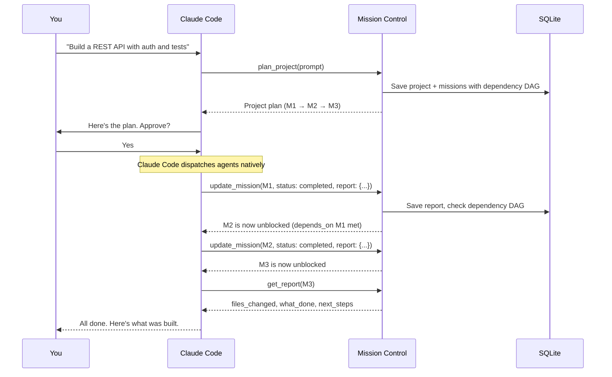
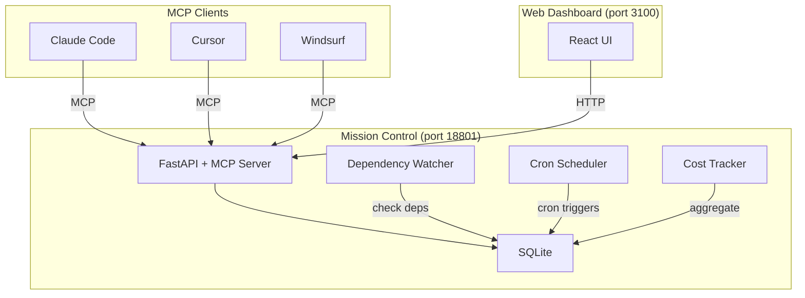

<div align="center">

# Claude Mission Control

**Mission tracking, dependency scheduling, and dashboard for Claude Code agents.**

[](LICENSE)
[](https://python.org)
[](https://nodejs.org)
[](https://modelcontextprotocol.io)

Claude Code already dispatches agents and runs them in isolated worktrees. What it doesn't do is **remember missions across sessions**, **enforce dependency chains**, **schedule recurring tasks**, or **track costs**. That's what Mission Control adds.

Improved fork of [claude-devfleet](https://github.com/LEC-AI/claude-devfleet).

</div>

---

## What Claude Code Does vs What Mission Control Adds

| Capability | Claude Code (built-in) | Mission Control |
|-----------|----------------------|-----------------|
| Dispatch agents | Native `Agent` tool | -- |
| Worktree isolation | `isolation: "worktree"` | -- |
| Parallel execution | Multiple agent calls | -- |
| Model routing | `model: "haiku"/"sonnet"/"opus"` | -- |
| **Persistent mission tracking** | -- | Missions survive conversation restarts |
| **Dependency DAG** | -- | "Don't start tests until API is done" |
| **Scheduled agents** | -- | Cron jobs (nightly tests, daily reviews) |
| **Cost tracking** | -- | Aggregated spend across all missions |
| **Web dashboard** | -- | Visual overview of all projects and missions |
| **Structured reports DB** | -- | Searchable history of what agents built |
| **Cross-session resume** | -- | Pick up where any agent left off |

---

## Demo


---

## Quick Start

```bash
git clone https://github.com/Cyvid7-Darus10/claude-mission-control.git
cd claude-mission-control
./start.sh
```

- **Dashboard:** http://localhost:3100
- **API:** http://localhost:18801
- **API Docs:** http://localhost:18801/docs

### Connect to Claude Code

```bash
claude mcp add mission-control --transport http http://localhost:18801/mcp
```

Then in Claude Code:

```
"Use mission-control to plan a project: build a REST API with auth and tests"
```

---

## How It Works



---

## Architecture



---

## Features

### Mission Tracking

| Feature | Description |
|---------|-------------|
| **Persistent Missions** | Projects and missions saved to SQLite — survive conversation restarts |
| **Structured Reports** | Agents report: files changed, what's done, what's open, next steps |
| **Mission History** | Searchable history of all agent work across projects |
| **Project Organization** | Group missions by project with tags and priorities |

### Dependency Scheduling

| Feature | Description |
|---------|-------------|
| **Dependency DAG** | Missions depend on other missions; watcher tracks when deps are met |
| **Auto-Dispatch Signals** | Claude Code gets notified when blocked missions become unblocked |
| **Cron Scheduler** | Recurring missions on a schedule (nightly tests, daily reviews) |
| **Mission Events** | Full audit log: dependency_met, dispatched, completed, failed |

### Dashboard

| Feature | Description |
|---------|-------------|
| **Project Overview** | All projects, missions, and their status at a glance |
| **Cost Tracking** | Aggregated token usage and spend across all missions |
| **Live Status** | Real-time mission status updates |
| **Report Viewer** | Browse structured reports from all completed missions |

### MCP Tools

Any MCP-compatible client can use these tools:

| Tool | Description |
|------|-------------|
| `plan_project` | Natural language → project with chained missions |
| `create_project` | Create a project manually |
| `create_mission` | Add a mission with dependencies and auto-dispatch |
| `update_mission_status` | Update status (draft/ready/running/completed/failed) + cost/tokens |
| `submit_report` | Submit structured report (files changed, what's done, next steps) |
| `get_mission_status` | Check progress of any mission |
| `get_unblocked_missions` | Get missions whose deps are satisfied and ready to start |
| `get_report` | Read structured report |
| `get_cost_summary` | Aggregated cost/token data across projects |
| `get_dashboard` | Overview: projects, mission stats, costs |
| `list_projects` | Browse all projects |
| `list_missions` | List missions, filter by status |

---

## Setup

### Prerequisites

- Python 3.11+
- Node.js 18+
- [Claude Code CLI](https://docs.anthropic.com/en/docs/claude-code) installed

### Option A: One-Command (Recommended)

```bash
git clone https://github.com/Cyvid7-Darus10/claude-mission-control.git
cd claude-mission-control
./start.sh
```

### Option B: Manual

```bash
git clone https://github.com/Cyvid7-Darus10/claude-mission-control.git
cd claude-mission-control

# Backend
python3 -m venv venv
source venv/bin/activate
pip install -r backend/requirements.txt
cd backend && uvicorn app:app --host 0.0.0.0 --port 18801 --reload

# Frontend (separate terminal)
cd frontend && npm install && npm run dev
```

### Option C: Docker

```bash
docker compose up -d
# Dashboard: http://localhost:3101
# API: http://localhost:18801
```

### Connect Your Editor

<details>
<summary><b>Claude Code</b></summary>

```bash
claude mcp add mission-control --transport http http://localhost:18801/mcp
```

</details>

<details>
<summary><b>Cursor</b></summary>

Add to `.cursor/mcp.json`:
```json
{
  "mcpServers": {
    "mission-control": {
      "type": "http",
      "url": "http://localhost:18801/mcp"
    }
  }
}
```

</details>

<details>
<summary><b>Windsurf / Cline</b></summary>

Add to your MCP settings:
```json
{
  "mission-control": {
    "type": "http",
    "url": "http://localhost:18801/mcp"
  }
}
```

</details>

---

## Configuration

| Variable | Default | Description |
|----------|---------|-------------|
| `DEVFLEET_DB` | `data/devfleet.db` | SQLite database path |
| `DEVFLEET_WATCHER_INTERVAL` | `5` | Dependency watcher poll interval (seconds) |
| `DEVFLEET_SCHEDULER_INTERVAL` | `60` | Cron scheduler check interval (seconds) |
| `DEVFLEET_PROJECTS_DIR` | `projects/` | Base directory for planner-created projects |

---

## Plugins

Extend Mission Control with custom hooks. Drop a Python file into `plugins/`:

```python
# plugins/slack_notify.py
def register(registry):
    @registry.hook("post_complete")
    async def notify_slack(mission, report):
        import httpx
        await httpx.AsyncClient().post(WEBHOOK, json={
            "text": f"Mission '{mission['title']}' done! Files: {report['files_changed']}"
        })
```

Hook events: `on_unblocked`, `post_complete`, `post_fail`, `pre_plan`, `post_plan`

---

## Roadmap

- [x] Strip redundant agent dispatch engine (Claude Code handles this natively)
- [ ] Add API authentication
- [ ] Event-driven dependency watcher (replace polling)
- [ ] Structured logging and observability
- [ ] Test coverage

---

## Credits

- **[claude-devfleet](https://github.com/LEC-AI/claude-devfleet)** by LEC-AI — Original multi-agent orchestration platform. The foundation.

## License

Apache 2.0 — See [LICENSE](LICENSE)

---

<div align="center">

Made by [Cyrus David Pastelero](https://github.com/Cyvid7-Darus10)

</div>
