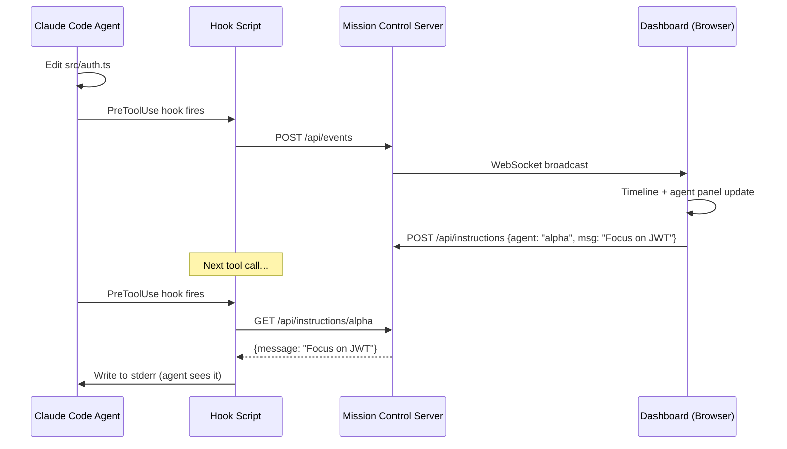

<div align="center">

# Claude Mission Control

**Real-time command center for Claude Code agents.**

[](LICENSE)
[](https://nodejs.org)
[](https://nodejs.org)

See what your Claude Code agents are doing. Assign missions. Watch them work. Step in when needed.

Palantir-inspired dark UI. Only 2 dependencies. No React, no Python, no Docker.

</div>

---

## The Problem

You're running multiple Claude Code agents — maybe one building auth, another writing tests, a third reviewing a PR. But it's all happening in separate terminals. You lose track of what each agent is doing, which files they're touching, and whether they're stuck.

## The Solution

Mission Control connects to Claude Code via hooks. Every tool call, file edit, and bash command is streamed to a web dashboard in real-time. You see all agents at a glance, assign missions, track dependencies, and send instructions.

```
┌─ MISSION CONTROL ──────────────────────────── 3 agents ● 5 missions ─┐
├──────────────┬───────────────────────────────────────────────────────-─┤
│ > AGENTS     │ > MISSIONS                                             │
│              │                                                        │
│ ● alpha      │ [QUEUED]  Auth middleware         priority: HIGH        │
│   editing    │ [ACTIVE]  API routes        ← alpha  02:34 elapsed     │
│   auth.ts    │ [ACTIVE]  Unit tests        ← bravo  01:12 elapsed     │
│              │ [DONE]    Project setup      completed 5m ago           │
│ ● bravo      │ [BLOCKED] E2E tests         waiting on: API routes     │
│   running    │                                                        │
│   npm test   │────────────────────────────────────────────────────────│
│              │ > TIMELINE                                              │
│ ○ charlie    │                                                        │
│   idle 45s   │ 12:34:02 alpha  EDIT  src/middleware/auth.ts            │
│              │ 12:34:01 bravo  BASH  npm test --coverage               │
│──────────────│ 12:33:58 alpha  READ  package.json                     │
│ > SEND MSG   │ 12:33:55 alpha  BASH  git status                       │
│ to: alpha    │ 12:33:50 charlie READ src/routes/payments.ts           │
│ > _          │ 12:33:48 alpha  WRITE src/types/auth.d.ts              │
└──────────────┴────────────────────────────────────────────────────────┘
```

---

## Setup

### Prerequisites

- **Node.js 18+** (`node -v` to check)
- **Claude Code** installed and working

### Step 1: Clone and Install

```bash
git clone https://github.com/Cyvid7-Darus10/claude-mission-control.git
cd claude-mission-control
npm install
npm rebuild better-sqlite3
```

### Step 2: Install Hooks into Claude Code

```bash
npx tsx src/index.ts install
```

This adds hooks to `~/.claude/settings.json` so Claude Code reports activity to Mission Control. You only need to do this once.

### Step 3: Start the Dashboard

```bash
npx tsx src/index.ts
```

```
  MISSION CONTROL v0.1.0
  ───────────────────────
  Dashboard: http://localhost:4280
  Hooks:     Listening for Claude Code events

  Press Ctrl+C to stop.
```

Open **http://localhost:4280** in your browser.

### Step 4: Use Claude Code Normally

Open another terminal and run `claude` as usual. Your agent will appear on the dashboard automatically — every tool call streams in real-time.

---

## How It Works

```
Claude Code runs a tool (Edit, Bash, Read, Write, etc.)
    │
    ▼
Hook fires (PreToolUse / PostToolUse / Stop)
    │
    ▼
Hook script POSTs event to localhost:4280/api/events
    │
    ▼
Server stores in SQLite + broadcasts via WebSocket
    │
    ▼
Dashboard updates in real-time
```



---

## Features

### Dashboard Panels

| Panel | What It Shows |
|-------|--------------|
| **Agents** | All active Claude Code sessions — status (active/idle/disconnected), current file, elapsed time |
| **Missions** | Tasks you create — assign to agents, track status, see dependencies |
| **Timeline** | Every tool call scrolling in real-time — agent, tool, file path, timestamp |
| **Command Bar** | Send instructions to any agent — delivered via stderr on next tool call |

### Core Features

| Feature | Description |
|---------|-------------|
| **Live Agent Monitor** | Agents auto-register when their first hook fires. Status: `●` active, `○` idle (60s), `◌` disconnected (5min) |
| **Mission Board** | Create missions with title, description, priority. Assign to agents. Track: queued → active → completed/failed |
| **Dependency DAG** | Missions can depend on other missions. Blocked missions auto-unblock when deps complete. Cycle detection prevents loops |
| **Send Instructions** | Type a message on the dashboard → agent receives it as stderr on next tool call |
| **Stuck Detection** | Agent with no events for 2+ minutes shows warning |
| **Persistent History** | All events, missions, and reports saved to SQLite — survives server restarts |

### Keyboard Shortcuts

| Key | Action |
|-----|--------|
| `Tab` | Cycle focus: Agents → Missions → Timeline → Command |
| `j` / `k` | Navigate up/down in focused panel |
| `Enter` | Select agent (filters timeline) or expand mission |
| `n` | New mission |
| `i` | Focus instruction input |
| `Esc` | Cancel / unfocus |

---

## What Gets Installed Where

| Component | Location |
|-----------|----------|
| Server + dashboard code | Where you cloned the repo |
| SQLite database | `~/.claude-mission-control/data.db` |
| Hook entries | `~/.claude/settings.json` (PreToolUse, PostToolUse, Stop) |
| Hook script | `<repo>/src/hook/mission-control-hook.js` |

---

## Commands

```bash
npx tsx src/index.ts              # Start the server (default port 4280)
npx tsx src/index.ts --port 5000  # Custom port
npx tsx src/index.ts --open       # Start and open browser
npx tsx src/index.ts install      # Install hooks into Claude Code
npx tsx src/index.ts uninstall    # Remove hooks from Claude Code
```

---

## API

All endpoints return JSON.

| Method | Endpoint | Description |
|--------|----------|-------------|
| `GET` | `/api/dashboard` | Stats: agent count, mission count, events |
| `GET` | `/api/agents` | List all agents |
| `PATCH` | `/api/agents/:id` | Rename an agent |
| `GET` | `/api/agents/:id/events` | Event history for an agent |
| `GET` | `/api/missions` | List missions (optional `?status=` filter) |
| `POST` | `/api/missions` | Create mission: `{ title, description, depends_on?, priority? }` |
| `PATCH` | `/api/missions/:id` | Update status, assign agent, complete/fail |
| `DELETE` | `/api/missions/:id` | Delete (queued only) |
| `POST` | `/api/events` | Receive hook events (used by hook script) |
| `GET` | `/api/events` | Query events (optional `?agent_id=&limit=&offset=`) |
| `POST` | `/api/instructions` | Send instruction: `{ target_agent_id, message }` |
| `GET` | `/api/instructions/:agentId` | Get pending instructions (used by hook script) |

WebSocket on same port — connects automatically from the dashboard.

---

## Design

Palantir Gotham-inspired. Dark grid layout, data-dense, monospace font, blue accent.

| Element | Value |
|---------|-------|
| Background | `#0d1117` |
| Panels | `#161b22` |
| Borders | `#30363d` |
| Accent | `#58a6ff` |
| Success | `#3fb950` |
| Warning | `#d29922` |
| Danger | `#f85149` |
| Font | JetBrains Mono / Fira Code / monospace |

No rounded corners. No shadows. No gradients. Sub-100ms renders.

---

## Tech Stack

| Component | Choice | Why |
|-----------|--------|-----|
| Runtime | Node.js + TypeScript | Single language, `npx` runnable |
| HTTP | Node.js `http` (no Express) | Zero framework deps |
| WebSocket | `ws` | Lightweight, battle-tested |
| Database | `better-sqlite3` | Embedded, no external server |
| Dashboard | Vanilla HTML/CSS/JS | No build step, served directly |
| **Total deps** | **2** (`better-sqlite3` + `ws`) | Minimal footprint |

---

## Uninstall

```bash
# Remove hooks from Claude Code
npx tsx src/index.ts uninstall

# Delete the database
rm -r ~/.claude-mission-control

# Delete the repo
rm -r ~/claude-mission-control
```

---

## Credits

Inspired by [claude-devfleet](https://github.com/LEC-AI/claude-devfleet), [disler/observability](https://github.com/disler/claude-code-hooks-multi-agent-observability), [agent-flow](https://github.com/patoles/agent-flow), [Palantir Gotham](https://www.palantir.com/platforms/gotham/)

## License

Apache 2.0 — See [LICENSE](LICENSE)

---

<div align="center">

Made by [Cyrus David Pastelero](https://github.com/Cyvid7-Darus10)

</div>
