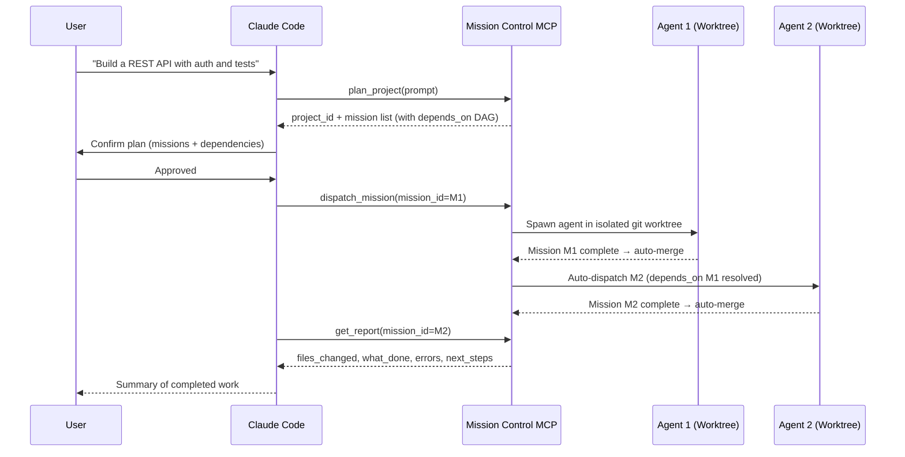

# Mission Control Skill for Claude Code (ECC)

Use Claude Mission Control as a multi-agent backend from Claude Code. Plan projects, dispatch agents, and monitor missions — all from your terminal.

## How It Works



## Prerequisites

- Claude Mission Control API running (default: `http://localhost:18801`)
- Claude Code (CLI) installed

## Step 1: Add Mission Control as an MCP Server

Mission Control exposes an MCP server via Streamable HTTP at `/mcp`. Add it to your Claude Code configuration.

### Option A: Project-level (recommended)

Add to `.claude/settings.json` in your project:

```json
{
  "mcpServers": {
    "mission-control": {
      "type": "http",
      "url": "http://localhost:18801/mcp"
    }
  }
}
```

### Option B: User-level

Add to `~/.claude/settings.json` to make Mission Control available in all projects:

```json
{
  "mcpServers": {
    "mission-control": {
      "type": "http",
      "url": "http://localhost:18801/mcp"
    }
  }
}
```

### Option C: CLI flag

```bash
claude mcp add mission-control --transport http http://localhost:18801/mcp
```

## Step 2: Install the Skill

Copy the skill file into your Claude Code commands directory:

```bash
# Project-level (available in this project only)
mkdir -p .claude/commands
cp integrations/ecc/devfleet.md .claude/commands/mission-control.md

# User-level (available in all projects)
mkdir -p ~/.claude/commands
cp integrations/ecc/devfleet.md ~/.claude/commands/mission-control.md
```

## Step 3: Verify

Start Claude Code and confirm Mission Control tools are available:

```bash
claude
```

Then try:

```
/mission-control Build a CLI todo app in Python with SQLite storage and tests
```

Or use the tools directly in conversation:

```
Use mission-control to plan a project: "REST API with user auth and rate limiting"
```

## Example Usage

### Plan and launch a project

```
> /mission-control Create a markdown blog engine with static site generation

Claude will:
1. Call plan_project to break it into missions
2. Show you the plan (missions, dependencies)
3. Dispatch the first mission to start the chain
4. Report back with project ID and status
```

### Check on running work

```
> What's running in Mission Control right now?

Claude calls get_dashboard and summarizes active agents, slot usage, and recent completions.
```

### Get a report

```
> Show me the report for mission abc-123

Claude calls get_report and presents the structured results: what was done, files changed, what was tested, next steps.
```

## Troubleshooting

**"Connection refused" errors**: Make sure the Mission Control API is running on port 18801. Check with:
```bash
curl http://localhost:18801/api/dashboard
```

**Tools not appearing**: Restart Claude Code after adding the MCP server config. Check that the SSE endpoint is reachable.

**Agent slots full**: Mission Control defaults to 3 concurrent agents. Check `get_dashboard` for slot usage. Wait for running missions to complete or cancel one with `cancel_mission`.
